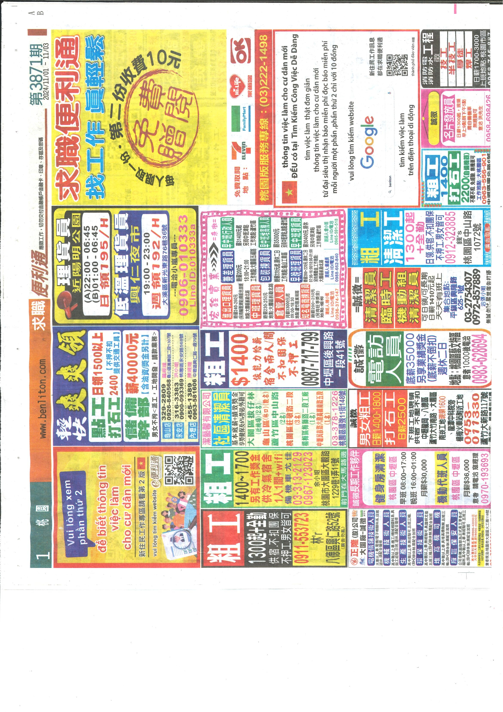
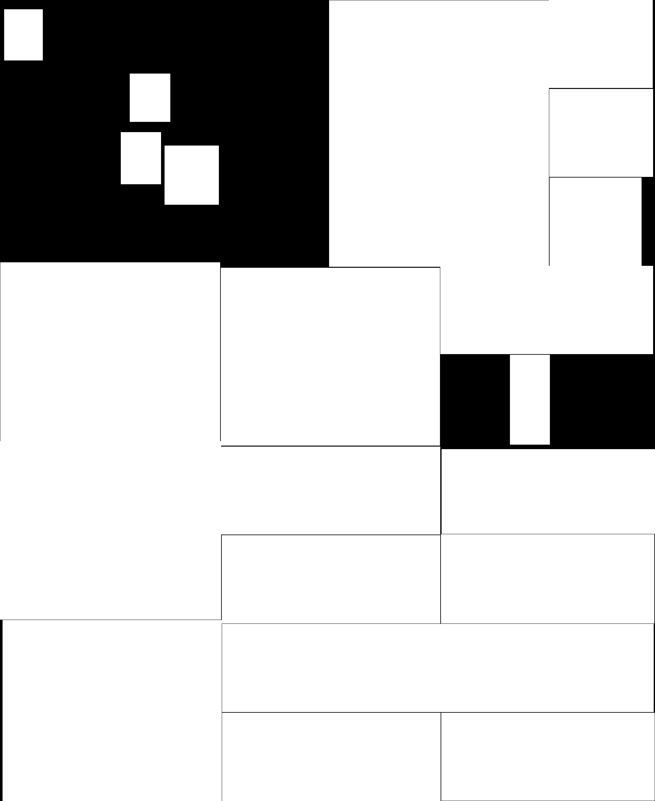

# Newspaper Job Block Extraction Tool

## Project Overview

This tool automatically extracts job advertisement blocks from scanned newspaper images, saving each block as a separate image file for further processing or digital archiving. It works with both individual images and PDF files.

## Features

- Processes both newspaper images and multi-page PDF files
- Extracts individual job blocks using contour detection algorithms
- Applies intelligent filtering to identify relevant blocks
- Handles nested content blocks to avoid duplication
- Detects unfilled areas to capture content that might be missed by primary detection
- Produces clean individual block images with appropriate naming conventions

## Example Results

### Before and After Comparison

#### Original Newspaper Image
<br>

*Original scanned newspaper with multiple job advertisements*

#### Extracted Job Blocks
<div style="display: flex; gap: 10px;">
  
  
  
</div>

*Individual job advertisement blocks automatically extracted from the newspaper*

The extraction process successfully separates individual job advertisements from the complex newspaper layout, making them ready for further processing such as OCR or archiving.

## Requirements

- Python 3.6+
- OpenCV (`cv2`)
- NumPy
- PyMuPDF (`fitz`)

## Installation

```bash
pip install opencv-python numpy pymupdf
```

## Usage

```python
# Process a single image file
python main.py

# To adjust input path and output directory, modify these lines in the script:
input_path = 'newspaper1.jpg'  # Change to your input file path
output_folder_base = input_path + '_blocks'  # Output directory
```

## Parameters

The code includes several configurable parameters:

- `debug`: Set to 1 to save additional debug images
- `min_dim`: Minimum dimensions for valid blocks (default: 120px)
- `max_aspect_ratio`: Maximum aspect ratio for valid blocks (default: 5.0)
- `dpi`: Resolution for PDF rendering (default: 300, adjusts dynamically based on page size)

## How It Works

1. **Preprocessing**: Converts the image to grayscale, applies Gaussian blur to reduce noise, uses adaptive thresholding to handle uneven lighting, and runs Canny edge detection to find clear edges.

2. **Initial Contour Detection**: Identifies potential content blocks using contour detection on the edge image.

3. **Smart Filtering**: 
   - Removes oversized blocks (>20% of the image area)
   - Filters noise and tiny blocks (smaller than minimum dimensions)
   - Eliminates blocks with extreme aspect ratios

4. **Containment Analysis**: Checks if blocks are contained within other blocks to avoid duplicate extraction.

5. **Missing Area Detection**: Identifies regions that might have been missed by the primary detection by:
   - Creating a mask of detected blocks
   - Applying morphological operations to refine the mask
   - Finding unfilled areas that might contain valid content
   - Checking for overlaps with detected blocks

6. **Final Filtering**: Performs a final containment check across all candidate regions.

7. **Output Generation**: Saves each valid block as an individual image and creates a debug combined image (when debug=1).

### Processing Visualization

| (a) Original image | (b) Canny Edges | (c) Filtered Contours | (d) Reconstructed Page |
|---------------------|-----------------|-----------------------|-------------------------|
|  |  |  |  |

## Limitations

- May struggle with very closely positioned job ads that appear as a single block
- Parameter sensitivity: Different newspaper layouts may require parameter adjustments
- Limited handling of rotated text blocks
- May occasionally miss blocks with poor contrast or unclear boundaries

## Potential Applications

- Newspaper/document digitization preprocessing
- Content extraction assistance for OCR systems
- Dataset creation for machine learning models
- Layout analysis for publishing research

## Detailed Report (Chinese Version)
[HackMD Link](https://hackmd.io/@OcvSVmsIRyeNNdWk7tMv2w/H1Zw-65Ckl)

---