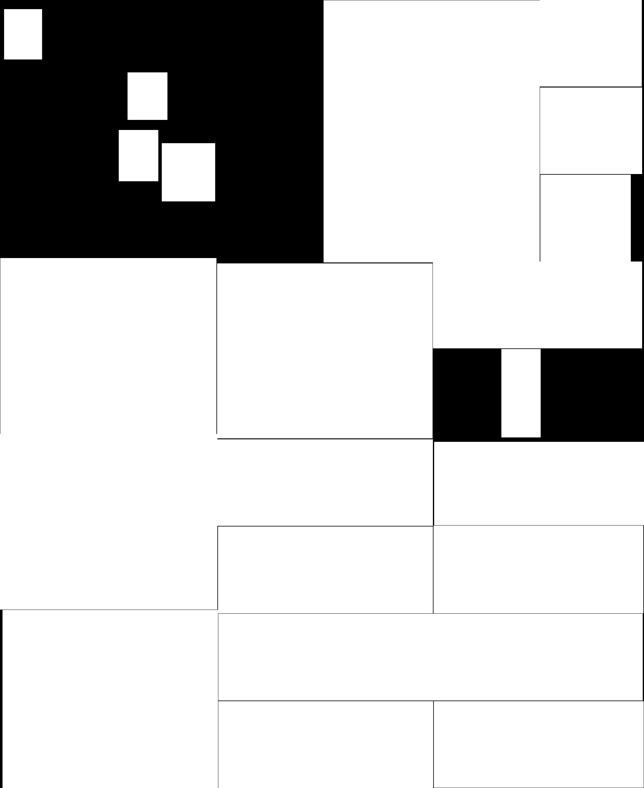

# Newspaper Job Block Extraction Tool

## Project Overview

This tool automatically extracts job advertisement blocks from scanned newspaper images, saving each block as a separate image file for further processing or digital archiving. It works with both individual images and PDF files.

## Features

- Processes both newspaper images and multi-page PDF files
- Extracts individual job blocks using contour detection algorithms
- Applies intelligent filtering to identify relevant blocks
- Handles nested content blocks to avoid duplication
- Detects unfilled areas to capture content that might be missed by primary detection
- Produces clean individual block images with appropriate naming conventions

## Example Results

### Before and After Comparison

#### Original Newspaper Image
<br>

*Original scanned newspaper with multiple job advertisements*

#### Extracted Job Blocks
<div style="display: flex; gap: 10px;">
  
  
  
</div>

*Individual job advertisement blocks automatically extracted from the newspaper*

The extraction process successfully separates individual job advertisements from the complex newspaper layout, making them ready for further processing such as OCR or archiving.

## Requirements

- Python 3.6+
- OpenCV (`cv2`)
- NumPy
- PyMuPDF (`fitz`)

## Installation

```bash
pip install opencv-python numpy pymupdf
```

## Usage

```python
# Process a single image file
python main.py

# To adjust input path and output directory, modify these lines in the script:
input_path = 'newspaper/newspaper1.jpg'  # Change to your input file path
output_folder_base = input_path + '_blocks'  # Output directory
```

## Parameters

The code includes several configurable parameters:

- `debug`: Set to 1 to save additional debug images
- `min_dim`: Minimum dimensions for valid blocks (default: 120px)
- `max_aspect_ratio`: Maximum aspect ratio for valid blocks (default: 5.0)
- `dpi`: Resolution for PDF rendering (default: 300, adjusts dynamically based on page size)

## How It Works

1. **Preprocessing**: Converts the image to grayscale, applies Gaussian blur to reduce noise, uses adaptive thresholding to handle uneven lighting, and runs Canny edge detection to find clear edges.

2. **Initial Contour Detection**: Identifies potential content blocks using contour detection on the edge image.

3. **Smart Filtering**: 
   - Removes oversized blocks (>20% of the image area)
   - Filters noise and tiny blocks (smaller than minimum dimensions)
   - Eliminates blocks with extreme aspect ratios

4. **Containment Analysis**: Checks if blocks are contained within other blocks to avoid duplicate extraction.

5. **Missing Area Detection**: Identifies regions that might have been missed by the primary detection by:
   - Creating a mask of detected blocks
   - Applying morphological operations to refine the mask
   - Finding unfilled areas that might contain valid content
   - Checking for overlaps with detected blocks

6. **Final Filtering**: Performs a final containment check across all candidate regions.

7. **Output Generation**: Saves each valid block as an individual image and creates a debug combined image (when debug=1).

### Processing Visualization

| (a) Original Image | (b) Canny Edges | (c) Filtered Contours | (d) Reconstructed Page |
|---------------------|-----------------|-----------------------|-------------------------|
|  |  |  |  |

## Limitations

- May struggle with very closely positioned job ads that appear as a single block
- Parameter sensitivity: Different newspaper layouts may require parameter adjustments
- Limited handling of rotated text blocks
- May occasionally miss blocks with poor contrast or unclear boundaries

## Potential Applications

- Newspaper/document digitization preprocessing
- Content extraction assistance for OCR systems
- Dataset creation for machine learning models
- Layout analysis for publishing research

## Web Interface

This tool now provides a Flask web interface that allows you to upload and process files through your browser.

### Installing Web Interface Dependencies

```bash
pip install -r requirements.txt
```

### Environment Configuration (Optional)

For convenience, you can set up environment variables to automatically configure the Google Gemini API key:

1. **Copy the example environment file:**
   ```bash
   cp .env.example .env
   ```

2. **Edit the `.env` file and add your Google Gemini API key:**
   ```bash
   GEMINI_API_KEY=your-actual-api-key-here
   ```

3. **Get your API key from:** https://makersuite.google.com/app/apikey

If you don't set up the `.env` file, you can still manually enter the API key in the web interface.

### Running the Web Server

```bash
python app.py
```

After startup, open your browser and navigate to http://127.0.0.1:5000 to use the web interface.

### Web Interface Features

1. **File Upload** - Supports JPG, PNG, and PDF files
2. **Debug Mode** - Option to save intermediate images from the processing steps to help understand the segmentation process
3. **AI Analysis** - Uses Google Gemini AI to automatically analyze extracted job blocks, identifying job titles, salaries, locations, and other information
4. **View Results** - View extracted blocks in a grid layout with AI analysis results
5. **Download Results** - Download all extracted blocks as a ZIP file, including CSV, SQL, and other formats
6. **🆕 Google Sheets Integration** - Directly send job data to your Google Sheets

### 🆕 Google Sheets Integration Feature

This tool now supports sending extracted job data directly to Google Sheets, allowing you to manage and analyze job data more conveniently.

#### Key Features:
- **One-Click Send**: After processing, directly send all job data to your Google Sheets
- **Auto Organization**: Data is automatically organized in table format, including job title, salary, location, contact information, and other fields
- **Real-time Sync**: Supports multiple sends, new data will be automatically added to the spreadsheet
- **Complete Records**: Includes processing time, source images, processing ID, and other complete information

#### Setup Steps:
1. Refer to `Google_Spreadsheet_Setup_Guide.md` to set up your Google Apps Script
2. Click "Send to Google Sheets" on the results page
3. Enter your Google Apps Script URL
4. Click send, and data will be automatically transmitted to your spreadsheet

#### Data Format:
Data sent to Google Sheets includes the following fields:
- Add Time, Job, Industry, Time, Salary, Location
- Contact Information, Other Information, Source Image, Page Number
- Job ID, Image ID, Process ID, Source System

For detailed setup instructions, please refer to: [Google Sheets Setup Guide](Google_Spreadsheet_Setup_Guide.md)

### Notes

- Upload file size is limited to 16MB
- Processing large files may take some time, please be patient
- To avoid excessive disk space usage, the system automatically cleans up processing results older than 24 hours

## Detailed Report
[HackMD Link](https://hackmd.io/@OcvSVmsIRyeNNdWk7tMv2w/H1Zw-65Ckl)

---