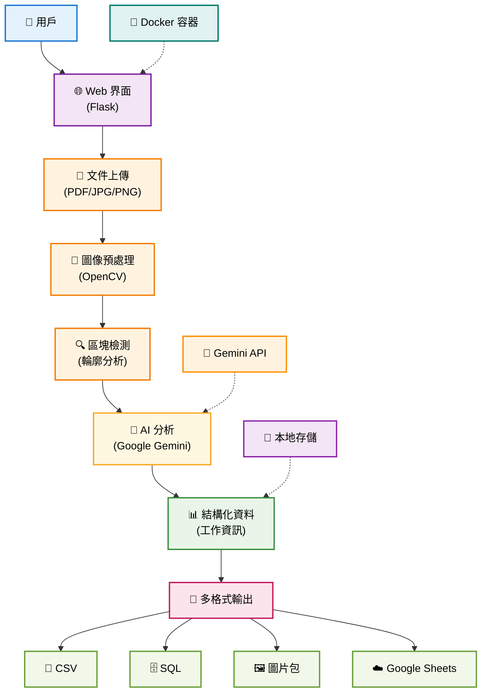

# 📰 報紙工作廣告區塊提取系統 (Newspaper Job Extractor)

<p align="center">
  
  
  
  
  
</p>

<p align="center">
  <strong>🚀 智能化的報紙工作廣告提取與分析系統</strong><br>
  使用 AI 技術自動從掃描報紙中提取工作廣告區塊，並進行結構化資料分析
</p>

<p align="center">
  <a href="https://newspaper-job-extractor-574680962945.asia-east1.run.app" target="_blank">
    
  </a>
</p>

---

## 🎯 專案概述

這是一個採用現代 Web 技術構建的智能報紙工作廣告提取系統，整合了 **OpenCV 圖像處理**、**Google Gemini AI** 和 **Flask Web 框架**。系統能夠自動從掃描的報紙圖像中識別並提取工作廣告區塊，並使用 AI 技術將其轉換為結構化資料。

### 🌟 核心特色

- 🔍 **智能區塊檢測**: 使用進階 OpenCV 算法精確識別工作廣告區塊
- 🤖 **AI 驅動分析**: 整合 Google Gemini 2.0 進行內容理解與結構化
- 🌐 **現代 Web 界面**: 響應式設計，支援即時進度追踪
- 🐳 **容器化部署**: 完整的 Docker 解決方案，支援生產環境
- 📊 **多格式輸出**: CSV、SQL、圖片等多種格式匯出
- ☁️ **雲端整合**: 一鍵同步至 Google Sheets

### 🏗️ 系統架構



<div align="center">
  <em>🔄 數據流向：用戶上傳 → 圖像處理 → AI分析 → 結構化輸出</em>
</div>

---

## 🚀 快速開始

### 🌐 線上版本

**立即體驗，無需安裝**：
- 🔗 **線上網址**: [https://newspaper-job-extractor-574680962945.asia-east1.run.app](https://newspaper-job-extractor-574680962945.asia-east1.run.app)
- ⚡ **即開即用**: 無需下載或配置，直接在瀏覽器中使用

### 📋 本地部署需求

- **Docker**: 20.10+ 與 Docker Compose 1.29+
- **記憶體**: 最少 2GB，推薦 4GB
- **存儲**: 最少 5GB 可用空間
- **網絡**: Internet 連接（AI 功能需要）
- **API**: Google Gemini API 密鑰

### 🐳 Docker 部署（推薦）

1. **環境檢查**
   ```bash
   # Windows 用戶
   .\docker-check.bat
   
   # Linux/macOS 用戶
   docker --version && docker-compose --version
   ```

2. **一鍵部署**
   ```bash
   # Windows
   .\docker-start.bat
   
   # Linux/macOS
   chmod +x docker-start.sh && ./docker-start.sh
   ```

3. **驗證部署**
   - 🌐 主應用: http://localhost:8080
   - 🏥 健康檢查: http://localhost:8080/health

### 💻 本地開發環境

```bash
# 1. 克隆專案
git clone <repository-url>
cd newspaper_job_extractor

# 2. 安裝 Python 依賴
pip install -r requirements.txt

# 3. 環境配置
cp .env.example .env
# 編輯 .env 檔案，添加 Gemini API 密鑰

# 4. 啟動開發服務器
python app.py
```

### 🔑 API 密鑰設置

1. 前往 [Google AI Studio](https://aistudio.google.com/app/apikey)
2. 創建新的 API 密鑰
3. 在系統首頁輸入 API 密鑰（會話期間有效）
4. 或在 `.env` 檔案中設置 `GEMINI_API_KEY`

---

## 🖼️ 處理效果展示

### 原始報紙 → 區塊提取
<div align="center">
  
  <br><em>原始掃描報紙</em>
</div>

### 提取的工作廣告區塊
<div align="center" style="display: flex; gap: 10px; justify-content: center;">
  
  
  
</div>
<div align="center"><em>自動提取的個別工作廣告</em></div>

### 處理步驟可視化
| 原始圖像 | 邊緣檢測 | 輪廓過濾 | 重建結果 |
|---------|---------|---------|---------|
|  |  |  |  |

---

## 📖 使用指南

### 1️⃣ 檔案上傳

**支援格式**:
- 📄 **PDF**: 多頁文件自動分頁處理
- 🖼️ **圖片**: JPG, PNG 格式
- 📁 **批量**: 最多 10 個檔案同時處理

**處理選項**:
- ✅ **自動校正方向**: AI 檢測並旋轉到正確方向
- ⚡ **並行處理**: 多線程加速 AI 分析

### 2️⃣ 處理進度

**進度階段**:
1. **上傳階段** (0-10%): 檔案接收與驗證
2. **處理階段** (10-60%): 圖像分析與區塊提取
3. **AI分析階段** (60-95%): 內容識別與結構化
4. **完成階段** (95-100%): 結果整理與儲存

### 3️⃣ 結果展示

**檢視功能**:
- 🔍 **圖片預覽**: 點擊放大檢視原圖
- 📝 **AI 分析**: 查看結構化提取資料
- 📊 **統計資訊**: 處理摘要與行業分布

---

## 📊 AI 分析結果

### 📋 資料結構

系統自動提取以下結構化資訊：

| 欄位 | 描述 | 範例 |
|------|------|------|
| **工作** | 職位名稱與職業類型 | 軟體工程師、行政助理 |
| **行業** | 19個標準行業分類 | 資訊科技業、金融業 |
| **時間** | 工作時間與班別 | 週一至週五 9:00-18:00 |
| **薪資** | 薪資待遇與福利 | 月薪 35,000-50,000 元 |
| **地點** | 工作地點與交通 | 台北市信義區、近捷運站 |
| **聯絡方式** | 電話、地址、Email | 02-1234-5678 |
| **其他** | 工作要求與備註 | 需具備英文能力 |

---

## 📥 匯出與整合

### 📄 下載格式

| 格式 | 描述 | 用途 |
|------|------|------|
| **CSV** | Excel 可開啟的表格檔 | 資料分析、製表 |
| **SQL** | 完整的資料庫語句 | 資料庫匯入 |
| **圖片** | 所有提取的區塊圖像 | 視覺化檢視 |
| **描述** | AI 分析的詳細文字 | 內容查看 |

### ☁️ Google Sheets 整合

**快速使用**:
1. 處理完成後點擊「創建 Google Sheets」
2. 系統自動創建新試算表並匯入資料
3. 自動設定共享權限，提供直接連結

**注意**: Google Sheets 整合功能需要配置 Google Apps Script URL

---

## 📚 文檔導覽

- 📖 **[詳細功能說明](docs/FEATURES.md)** - 完整功能特色與技術實現
- 🏗️ **[系統架構文檔](docs/ARCHITECTURE.md)** - 技術架構與設計說明
- ⚙️ **[配置與部署](docs/DEPLOYMENT.md)** - 進階配置與生產部署
- ❓ **[常見問題](docs/FAQ.md)** - 故障排除與最佳實踐

---

<div align="center">
  <p><strong>🎉 感謝使用報紙工作廣告區塊提取系統！</strong></p>
  <p>如果這個專案對您有幫助，請考慮給我們一個 ⭐ Star！</p>
</div>