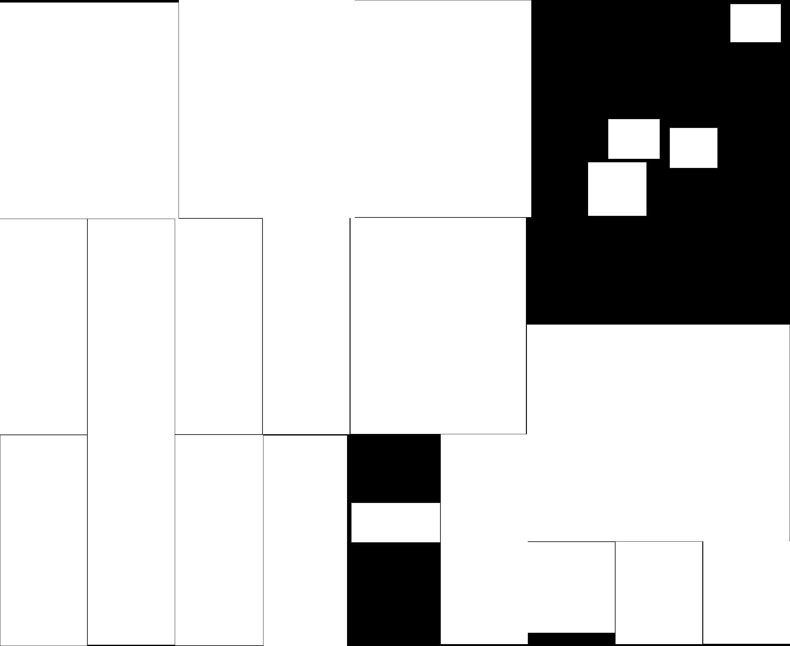

# 報紙工作廣告區塊提取系統

<p>
  
  
  
  
</p>

## 🎯 項目簡介

這是一個智能化的報紙工作廣告提取系統，能夠自動從掃描的報紙圖像中提取工作廣告區塊，並使用AI技術分析其中的職缺資訊。系統已完全Docker化，支援一鍵部署，適合24/7生產環境運行。

## ✨ 核心功能

### 🔧 圖像處理
- **多格式支持**: JPG、PNG、PDF多頁文件
- **智能區塊檢測**: 使用OpenCV進行精確的工作廣告區塊分割
- **方向自動校正**: AI檢測圖片方向並自動旋轉
- **高效處理**: 記憶體優化，大文件處理時僅使用5MB記憶體

### 🤖 AI分析
- **智能識別**: 使用Google Gemini 2.0模型分析工作內容
- **結構化資料**: 自動提取職位、薪資、地點、聯絡方式等資訊
- **行業分類**: 自動歸類到19個標準行業類別
- **並行處理**: 支援多線程AI分析，提升處理速度

### 🌐 Web介面
- **即時進度**: 詳細的處理進度顯示（上傳→處理→AI分析）
- **結果預覽**: 網格佈局展示所有提取的區塊
- **多格式下載**: CSV、SQL、圖片、描述文件一鍵下載
- **Google Sheets整合**: 直接將資料發送到試算表

### 🐳 Docker部署
- **一鍵啟動**: 完整的容器化解決方案
- **生產就緒**: 包含健康檢查、自動重啟、日誌管理
- **安全配置**: 非root用戶、資源限制、安全選項
- **自動清理**: 4小時自動清理機制，支援長期運行

## 🚀 快速開始

### Docker 部署（推薦）

1. **環境檢查**
   ```bash
   # Windows
   .\docker-check.bat
   
   # Linux/macOS
   docker --version && docker-compose --version
   ```

2. **一鍵啟動**
   ```bash
   # Windows
   .\docker-start.bat
   
   # Linux/macOS
   chmod +x docker-start.sh && ./docker-start.sh
   ```

3. **訪問應用**
   - 主頁面: http://localhost:5000
   - 健康檢查: http://localhost:5000/health

### 本地開發環境

1. **安裝依賴**
   ```bash
   pip install -r requirements.txt
   ```

2. **設置環境變數**
   ```bash
   cp env.example .env
   # 編輯 .env 檔案，添加您的 Gemini API 密鑰
   ```

3. **啟動應用**
   ```bash
   python app.py
   ```

## 🖼️ 處理效果展示

### 原始報紙 → 區塊提取
<div align="center">
  
  <br><em>原始掃描報紙</em>
</div>

### 提取的工作廣告區塊
<div align="center" style="display: flex; gap: 10px; justify-content: center;">
  
  
  
</div>
<div align="center"><em>自動提取的個別工作廣告</em></div>

### 處理步驟可視化
| 原始圖像 | 邊緣檢測 | 輪廓過濾 | 重建結果 |
|---------|---------|---------|---------|
|  |  |  |  |

## 📋 系統需求

- **Docker**: 20.10+ (推薦)
- **Docker Compose**: 1.29+
- **記憶體**: 最少1GB，推薦2GB
- **存儲空間**: 最少5GB可用空間
- **網絡**: 需要Internet連接以使用AI功能

## 🔧 配置選項

### 環境變數
```bash
# 必要配置
GEMINI_API_KEY=your_gemini_api_key_here

# 可選配置
FLASK_ENV=production
FLASK_HOST=0.0.0.0
FLASK_PORT=5000
MAX_CONTENT_LENGTH=16777216
```

### 處理參數
- **自動校正方向**: 啟用/停用圖片方向檢測
- **並行處理**: 啟用/停用多線程AI分析
- **除錯模式**: 保存處理步驟的中間圖像

## 📊 AI分析結果

系統自動提取以下資訊：
- **工作職位**: 職位名稱和職業類型
- **行業分類**: 19個標準行業類別自動歸類
- **工作條件**: 工作時間、薪資待遇
- **地理資訊**: 工作地點、服務區域
- **聯絡資訊**: 電話、地址、其他聯絡方式
- **額外資訊**: 工作要求、福利、備註

## 📥 下載格式

支援多種格式的結果下載：
- **CSV表格**: Excel可直接開啟的結構化資料
- **SQL資料庫**: 完整的建表和插入語句
- **圖片檔案**: 所有提取的工作區塊圖像
- **AI描述**: 詳細的文字分析結果
- **處理步驟**: 圖像處理的各階段圖片

## 🔗 Google Sheets 整合

### 設置步驟
1. 參考 [Google Sheets設置指南](Google_Spreadsheet_Setup_Guide.md)
2. 部署您的Google Apps Script
3. 在結果頁面點擊"發送到Google Sheets"
4. 輸入您的Apps Script URL

### 資料格式
發送到Google Sheets的資料包含：
- 新增時間、工作、行業、時間、薪資、地點
- 聯絡方式、其他資訊、來源圖片、頁碼
- 工作編號、圖片編號、處理編號、來源系統

## 🛠️ Docker 管理指令

```bash
# 基本操作
docker-compose ps                # 查看狀態
docker-compose logs -f           # 查看日誌
docker-compose down              # 停止服務
docker-compose restart          # 重啟服務

# 生產部署
docker-compose -f docker-compose.prod.yml up -d

# 自動測試
.\docker-test.bat               # Windows完整測試

# 手動清理
docker system prune -a          # 清理Docker資源
```

## 🔍 監控和管理

### 管理員介面
- `/admin/storage` - 查看存儲使用狀況
- `/admin/cleanup` - 手動執行清理
- `/admin/cleanup/auto` - 切換自動清理

### 健康檢查
- `/health` - 應用程式健康狀態
- `/api/status` - API服務狀態

### 自動清理
- 每4小時自動清理舊檔案
- 啟動時清理超過4小時的檔案
- 支援手動清理和狀態監控

## 🔒 安全特性

- **容器安全**: 非root用戶執行
- **資源限制**: CPU和記憶體使用限制
- **網絡隔離**: 獨立的Docker網絡
- **檔案權限**: 適當的檔案系統權限
- **自動更新**: 系統依賴自動更新

## 📚 詳細文檔

- [Docker部署指南](README-Docker.md) - 詳細的容器部署說明
- [Google Sheets整合](Google_Spreadsheet_Setup_Guide.md) - 試算表整合設置
- [Apps Script設置](GOOGLE_APPS_SCRIPT_SETUP.md) - Google Apps Script部署

## 🤝 技術支援

### 常見問題
1. **端口衝突**: 修改docker-compose.yml中的端口映射
2. **記憶體不足**: 調整Docker資源分配
3. **API配額**: 檢查Gemini API使用限制
4. **權限問題**: 確保Docker有適當的檔案權限

### 疑難排解
```bash
# 檢查容器狀態
docker-compose ps

# 查看詳細日誌
docker-compose logs --tail=50 newspaper-extractor

# 重建映像
docker-compose build --no-cache

# 完全重置
docker-compose down && docker system prune -a
```

## 📈 性能指標

- **處理速度**: 單頁報紙 < 30秒
- **記憶體使用**: 大文件處理時僅5MB
- **並發支持**: 支援多用戶同時使用
- **可用性**: 24/7運行能力
- **自動恢復**: 容器自動重啟機制

## 🎯 應用場景

- **新聞媒體**: 歷史報紙數位化
- **人力資源**: 工作市場分析
- **學術研究**: 就業趨勢研究
- **資料採集**: 大規模工作資訊收集
- **檔案管理**: 報紙內容結構化存儲

## 📄 授權條款

本專案採用 MIT 授權條款。詳見 [LICENSE](LICENSE) 檔案。

---

<div align="center">
  <p>⭐ 如果這個專案對您有幫助，請給我們一個星星！</p>
  <p>🐛 發現問題？歡迎提交 Issue 或 Pull Request</p>
</div>