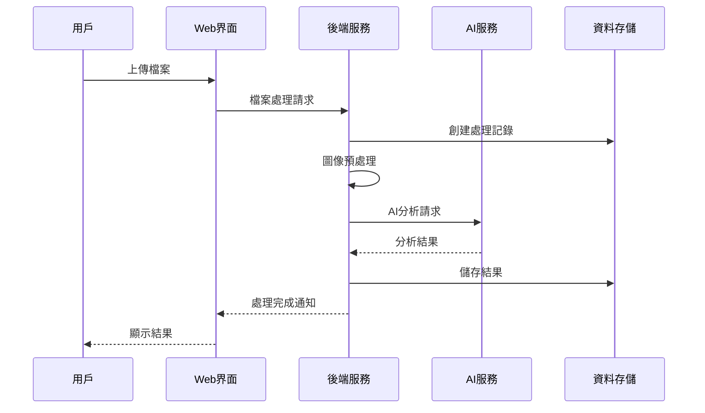

# 🏗️ 系統架構文檔

## 📁 專案結構

```
newspaper_job_extractor/
├── 📁 app.py                    # 主應用程式入口
├── 📁 config/                   # 配置管理
│   ├── settings.py             # 系統設定
│   └── __init__.py
├── 📁 routes/                   # 路由處理
│   ├── main_routes.py          # 主頁路由
│   ├── upload_routes.py        # 上傳處理
│   ├── results_routes.py       # 結果展示
│   └── __init__.py
├── 📁 services/                 # 業務邏輯
│   ├── ai_service.py           # AI 分析服務
│   ├── image_processing_service.py  # 圖像處理
│   ├── progress_tracker.py     # 進度追踪
│   ├── cleanup_service.py      # 清理服務
│   └── __init__.py
├── 📁 models/                   # 資料模型
│   ├── storage.py              # 內存存儲
│   └── __init__.py
├── 📁 utils/                    # 工具函數
│   ├── file_utils.py           # 檔案處理工具
│   └── __init__.py
├── 📁 templates/                # HTML 模板
│   ├── index.html              # 主頁面
│   └── results.html            # 結果頁面
├── 📁 static/                   # 靜態資源
├── 📁 newspaper/                # 示例圖片
├── 📁 docs/                     # 文檔資料
├── 🐳 Dockerfile               # 容器建構檔
├── 🐳 docker-compose.yml       # 開發環境配置
├── 🐳 docker-compose.prod.yml  # 生產環境配置
├── 📦 requirements.txt         # Python 依賴
└── 📖 README.md                # 專案說明
```

## 🔌 API 端點

| 端點 | 方法 | 描述 | 參數 |
|------|------|------|------|
| `/` | GET | 主頁面 | - |
| `/upload` | POST | 檔案上傳處理 | files, options |
| `/results/<process_id>` | GET | 結果展示頁面 | process_id |
| `/download/<process_id>/<format>` | GET | 檔案下載 | process_id, format |
| `/health` | GET | 健康檢查 | - |
| `/admin/storage` | GET | 存儲狀態 | - |
| `/admin/cleanup` | POST | 手動清理 | - |

## 🔄 資料流程



## 🧩 核心組件

### 1. 圖像處理服務 (Image Processing Service)

**職責**:
- 檔案格式檢測與轉換
- 圖像預處理與優化
- 區塊檢測與提取
- 方向校正

**技術棧**:
- OpenCV: 圖像處理
- PyMuPDF: PDF 處理
- Pillow: 圖像格式轉換

### 2. AI 分析服務 (AI Service)

**職責**:
- 內容識別與提取
- 結構化資料生成
- 行業分類
- 並行處理管理

**技術棧**:
- Google Gemini API
- ThreadPoolExecutor
- 結構化提示工程

### 3. 進度追踪服務 (Progress Tracker)

**職責**:
- 即時進度更新
- 狀態管理
- WebSocket 通信

**技術棧**:
- Flask-SocketIO
- 內存狀態管理

### 4. 清理服務 (Cleanup Service)

**職責**:
- 定時檔案清理
- 記憶體管理
- 存儲優化

**技術棧**:
- APScheduler
- 系統監控

## 🔒 安全架構

### 容器安全

| 特性 | 描述 | 實現 |
|------|------|------|
| **非 Root 執行** | 使用專用用戶執行應用 | Dockerfile USER 指令 |
| **資源限制** | CPU 和記憶體使用限制 | Docker Compose 資源配置 |
| **網絡隔離** | 獨立的 Docker 網絡 | 自定義網絡配置 |
| **檔案權限** | 適當的檔案系統權限 | chown 與 chmod 設定 |

### 資料安全

- 🗂️ **本地處理**: 敏感資料不離開您的環境
- 🧹 **自動清理**: 處理完成後自動清理暫存檔案
- 🔒 **API 安全**: 安全的 API 密鑰管理
- 📝 **日誌記錄**: 詳細的操作日誌追踪

## 📈 性能優化

### 記憶體優化

1. **動態 Base64 生成**: 避免大量圖像同時載入記憶體
2. **垃圾回收**: 主動釋放不需要的物件
3. **分批處理**: 限制同時處理的檔案數量
4. **快取管理**: 智能快取策略

### 處理速度優化

1. **並行處理**: 多線程 AI 分析
2. **非同步操作**: 非阻塞式檔案處理
3. **智能重試**: 指數退避算法處理 API 限制
4. **預處理優化**: 圖像處理管道優化

## 🔧 配置管理

### 環境變數

```bash
# API 配置
GEMINI_API_KEY=your_api_key_here
GOOGLE_APPS_SCRIPT_URL=your_script_url_here

# 伺服器配置
FLASK_HOST=0.0.0.0
FLASK_PORT=8080
FLASK_ENV=production

# 檔案處理
MAX_CONTENT_LENGTH=16777216
MAX_FILES_PER_UPLOAD=10

# 清理設定
CLEANUP_MAX_AGE_HOURS=4
CLEANUP_INTERVAL_HOURS=4
CLEANUP_MAX_FILE_COUNT=10
```