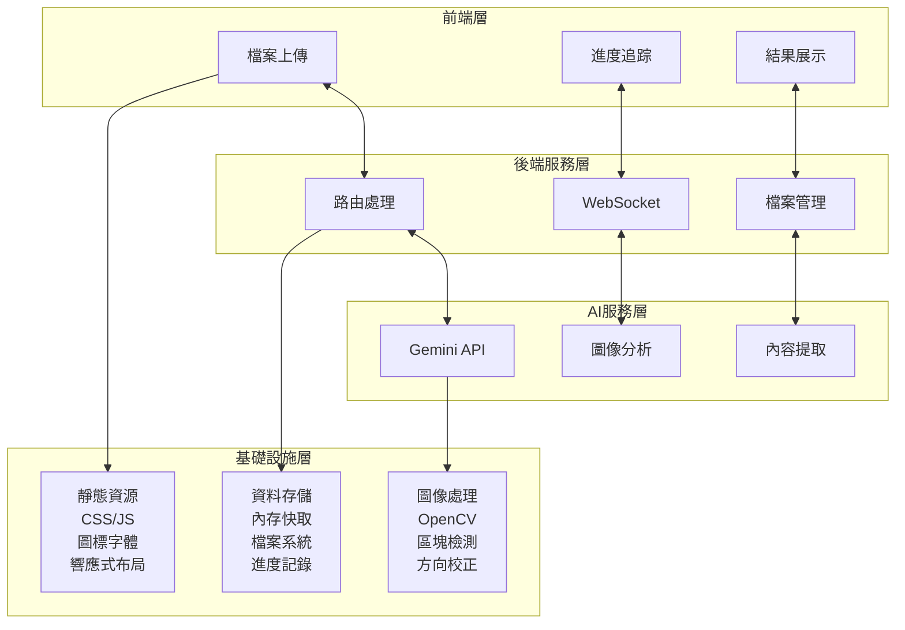

# ✨ 功能特色詳細說明

## 🖼️ 圖像處理引擎

### 核心功能

| 功能 | 描述 | 技術實現 |
|------|------|----------|
| **多格式支援** | JPG、PNG、PDF (多頁) | PyMuPDF + OpenCV |
| **智能區塊檢測** | 自動識別工作廣告區域 | 輪廓檢測 + 幾何分析 |
| **方向自動校正** | AI 檢測圖片方向並旋轉 | Gemini Vision API |
| **記憶體優化** | 智能記憶體管理，節省 60-70% 記憶體使用 | 動態 Base64 生成 + 垃圾回收 |

### 處理流程

1. **檔案接收**: 支援拖拽上傳和批量選擇
2. **格式檢測**: 自動識別檔案類型並選擇對應處理器
3. **圖像預處理**: 降噪、對比度調整、邊緣增強
4. **區塊檢測**: 使用輪廓檢測算法識別廣告區域
5. **方向校正**: AI 分析圖片方向並自動旋轉

## 🧠 AI 分析系統

### 分析能力

| 功能 | 描述 | 模型配置 |
|------|------|----------|
| **內容識別** | 提取職位、薪資、地點等資訊 | Gemini 2.0 Flash |
| **行業分類** | 自動歸類至 19 個標準行業 | 結構化提示工程 |
| **並行處理** | 多線程 AI 分析加速 | ThreadPoolExecutor |
| **智能重試** | API 限制自動重試機制 | 指數退避算法 |

### 🏭 行業分類標準

系統採用 19 個標準行業類別進行自動分類：

- 🏭 製造業
- 🏗️ 建築營造業
- 🛒 批發零售業
- 🍽️ 住宿餐飲業
- 🚚 運輸倉儲業
- 💰 金融保險業
- 🏢 專業服務業
- 💻 資訊科技業
- 🎓 教育業
- 🏥 醫療保健業
- 🎨 藝術娛樂業
- 🏛️ 公共行政業
- 🔧 其他服務業
- 🌾 農林漁牧業
- ⚡ 電力燃氣業
- 💧 用水供應業
- 📺 傳播業
- 🏠 不動產業
- ❓ 其他

## 🌐 Web 應用架構

## 🛠️ 記憶體監控

### 監控功能

系統提供即時記憶體監控功能：

**Web 管理介面**:
- 📊 `/admin/storage`: 查看記憶體使用狀態
- 🧹 `/admin/memory/clear`: 手動記憶體清理

**監控指標**:
- **RSS 記憶體**: 實際物理記憶體使用
- **VMS 記憶體**: 虛擬記憶體使用
- **記憶體百分比**: 系統記憶體使用率
- **可用記憶體**: 系統剩餘記憶體

### 💡 使用建議

**最佳實踐**:
1. 🔄 **分批處理**: 避免同時上傳過多大檔案
2. ⏰ **定期清理**: 利用自動清理機制或手動清理
3. 📏 **檔案大小**: 建議單檔不超過 8MB
4. 🖥️ **系統配置**: Docker 環境建議分配至少 4GB 記憶體

**故障排除**:
- 記憶體不足時系統會自動觸發清理
- 可透過 `/admin/memory/clear` 手動釋放記憶體
- 監控 `/admin/storage` 了解記憶體使用趨勢

## ☁️ Google Sheets 整合詳細說明

### 試算表結構

**自動創建的試算表包含**:
- 📊 **職缺資料**: 完整的結構化工作資訊
- 📈 **處理摘要**: 統計資料與行業分布圖表
- 🎨 **自動格式**: 標題樣式、顏色與邊框

### 功能特色

1. **一鍵創建**: 處理完成後直接創建新試算表
2. **自動格式化**: 專業的表格樣式與配色
3. **即時同步**: 資料即時上傳至雲端
4. **共享設定**: 自動設定適當的共享權限 